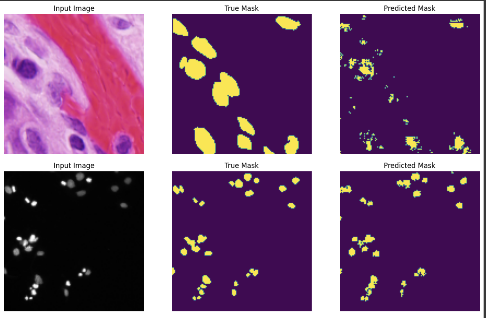
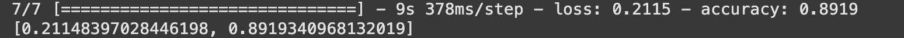

# Nuclei detection with UNet 

This is a semantic segmentation task to distinguish the nuclei from its surrounding.

## Architecture
The following is the architecture of the model:


In the training process, the performance of the model can be seen in the following image:

## Development


We can see how similar our model is in the predicted segmentation vs the true mask




## Deployment

On our final testing stage, we achieve the following accuracy score:



and, here is how similar our prediction compared to the ground truth mask:


## Cloning The Repo
To run the notebook, it is suggested that we run on google colab. 

The following requirements are to be achieved if you were to run on own environment:
- tensorflow==2.8
- tensorflow-addons-0.23.0
- protobuf==3.20.*

You are also required to execute the following command:
```

pip install git+https://github.com/tensorflow/examples.git
```

In google colab, please upload the data-science-bowl-2018.zip file before running the notebook.
Note that you may have to restart the kernel few times to update the environment in google colab.
